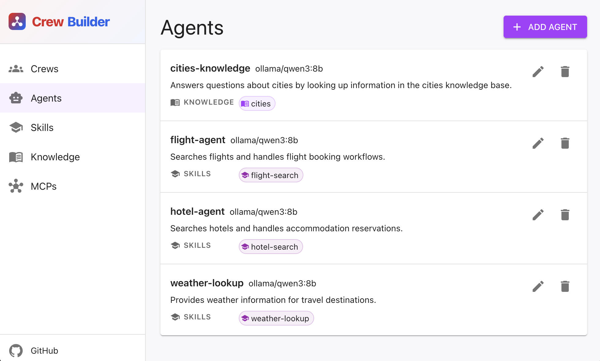

# Crew Builder

Build a team of AI agents in a web UI, then download a project you can run.

No need to hand-write CrewAI configs. Click around, hit **Build**, unzip, run.



## Why this project

Crew Builder produces a **multi-agent system with no external dependencies** — no databases, no embedding stores, no vector DBs, no shared infrastructure you have to stand up and operate.

What you download is a self-contained project: agents, skills, knowledge, and tools packaged to run on their own (expect external MCPs). That keeps the stack simple and lets you **scale in many ways** — more agents in a crew, more crews side by side, more machines or containers running the same zip — without tying growth to a central database or embedding service.
You can use the downloaded project as a good boilerplate for your work.

## Run it

You need [Docker](https://docs.docker.com/get-docker/).

```bash
git clone https://github.com/<your-org>/crewbuilder.git
cd crewbuilder
docker compose up --build
```

Open [http://localhost:8080](http://localhost:8080).

There's a sample **travel-assistant** crew already loaded so you can poke around.

## Make a crew and run it

First of all, you need [Ollama](https://ollama.com/library/qwen3:8b). Install and run:

```
ollama run qwen3:8b
```

The code shipped by some sample data-set.

1. Create **agents** (who does what).
2. Optionally add **skills**, **knowledge**, or **MCPs** (extra tools / docs).
3. Create a **crew** and add your agents.
4. Click **Build** → download the zip.
5. Unzip it
6. (Optional if you used cloud provider, default is ollama) copy `.env.example` to `.env`, put in your API keys.
7. Run:

```bash
uv run main.py
```

Try to feed some samples. Ex:  
`What’s the weather like in Berlin?` or `I’m planning to travel from London to Berlin in summer. I’d like to time the trip around a good music festival. Please find the best dates, along with suitable flights and a hotel, keeping my total budget around €2,000.`

Run it. It takes time, specially if you are using your local machine and Ollama. Your answer lands in `output/report.md`.

## Words we use

- **Agent** — one AI worker with a job ([CrewAI agents](https://docs.crewai.com/en/concepts/agents))
- **Crew** — a team of agents plus a boss that delegates ([CrewAI crews](https://docs.crewai.com/en/concepts/crews))
- **Skill** — reusable instructions an agent can follow ([Agent Skills](https://agentskills.io/home))
- **Knowledge** — docs the agent can search (packaged as a local FAISS index in the download)
- **MCP** — an external tool server the agent can call ([Model Context Protocol](https://modelcontextprotocol.io/))


## References

- [CrewAI](https://docs.crewai.com/) — multi-agent framework the downloaded project runs on
- [Agent Skills](https://agentskills.io/home) — open format for portable agent instructions (`SKILL.md`)
- [Model Context Protocol (MCP)](https://modelcontextprotocol.io/) — standard for connecting agents to external tools
- [Ollama](https://ollama.com/) — local LLM runtime (default provider; sample uses [qwen3:8b](https://ollama.com/library/qwen3:8b))
- [uv](https://docs.astral.sh/uv/) — Python package runner used to launch the generated crew
- [Docker](https://docs.docker.com/get-docker/) — runs the Crew Builder stack itself


## License

[MIT](LICENSE) © 2026 Hamed Abdollahpour